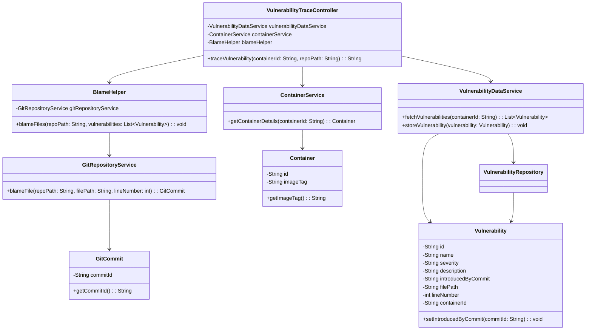
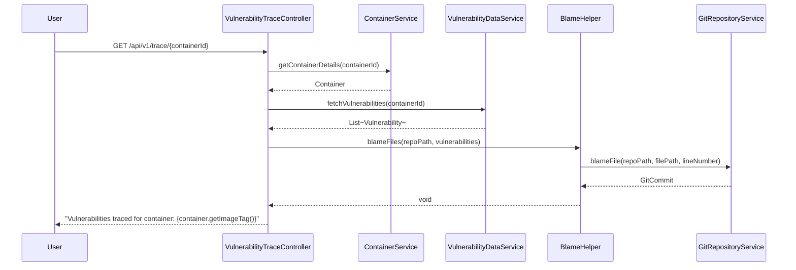

# Project Name

## Overview
This project is a Spring Boot application that traces vulnerabilities in a containerized environment. It fetches vulnerability data, blames the files in a Git repository, and provides an API to trace vulnerabilities for a given container.

## Tech Stack
- **Java**: Programming language used for development.
- **Spring Boot**: Framework for building the application.
- **Gradle**: Build tool for managing dependencies and building the project.
- **JPA (Java Persistence API)**: For database interactions.
- **Lombok**: To reduce boilerplate code.
- **Log4j2**: For logging.

## Local Setup
1. **Clone the repository**:
    ```sh
    git clone <repository-url>
    cd <repository-directory>
    ```

2. **Install dependencies**:
   Ensure you have Gradle installed. Then run:
    ```sh
    ./gradlew build
    ```

3. **Run the application**:
    ```sh
    ./gradlew bootRun
    ```

4. **Access the API**:
   The application will be running at `http://localhost:8080`. You can access the API endpoint at `http://localhost:8080/api/v1/trace/{containerId}`.

## Class Diagram [Mermaid Syntax]


## Sequence Diagram [Mermaid Syntax]


## Additional Information
- **Global Exception Handling**: The project includes a `GlobalExceptionHandler` to handle various exceptions and provide meaningful error responses.
- **Logging**: Log4j2 is used for logging errors and important information.

For more details, refer to the source code and documentation within the project.