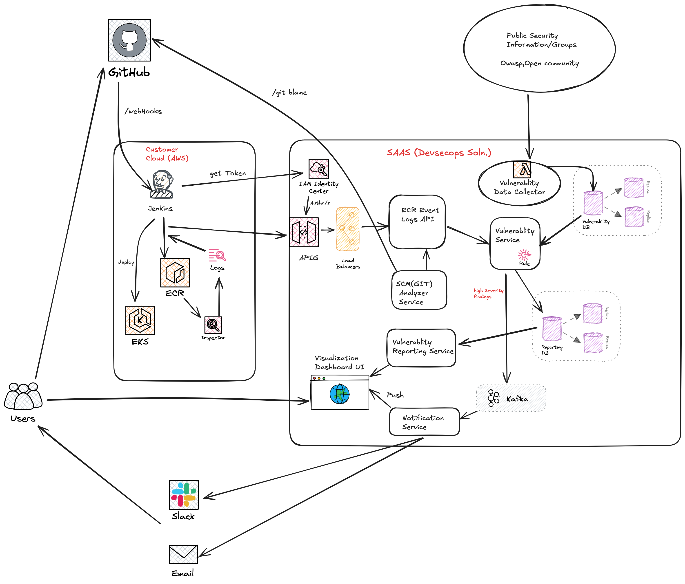
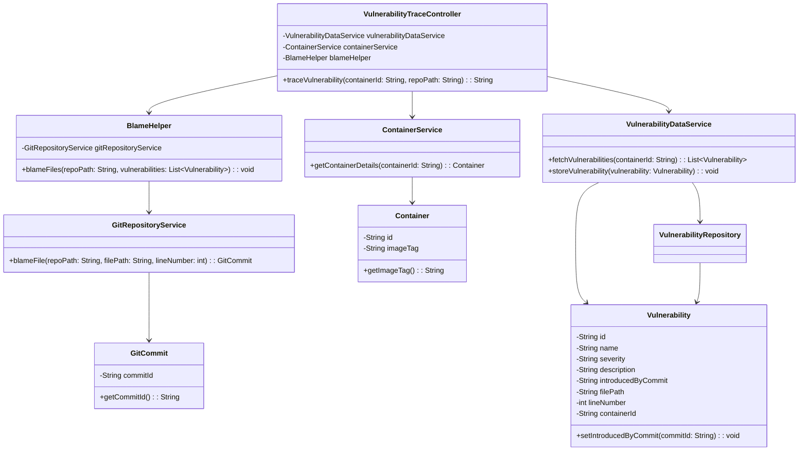

# Devloper Security Tracing Application

## Overview
This project is a Spring Boot application that traces vulnerabilities in a containerized environment. It fetches vulnerability data, blames the files in a Git repository, and provides an API to trace vulnerabilities for a given container.

For demo purposes, it scans this project's repository `.git` folder. However, if required, you can pass a different Git repository path as an optional request parameter in the Spring Boot controller endpoint.

## Tech Stack
- **Java**: Programming language used for development.
- **Spring Boot**: Framework for building the application.
- **Gradle**: Build tool for managing dependencies and building the project.
- **JPA (Java Persistence API)**: For database interactions.
- **Lombok**: To reduce boilerplate code.
- **Log4j2**: For logging.

## System Architecture Diagram


## Architecture
The application follows a layered architecture with the following components:
- **Controller**: Exposes the API endpoints.
- **Service**: Contains the business logic.
- **Repository**: Interacts with the database.
- **Model**: Contains the data models.
- **Helper**: Contains utility classes.
- **Exception**: Contains custom exceptions.

## Architecture Decisions

For more detailed documentation, please visit our [ADR Wiki](https://github.com/git4neeraj/devsecurityapp/wiki/Architecture-Decision-Record-(ADR):-SaaS-Vulnerability-Tracking-System).

## Low-Level Design
1. The `VulnerabilityTraceController` receives a request to trace vulnerabilities for a container.
2. It fetches the container details using the `ContainerService`.
3. It fetches the vulnerabilities for the container using the `VulnerabilityDataService`.
4. It uses the `BlameHelper` to blame the files in the Git repository.
5. The `BlameHelper` uses the `GitRepositoryService` to blame the files.
6. The `BlameHelper` updates the `Vulnerability` objects with the commit that introduced the vulnerability.
7. The `VulnerabilityTraceController` returns the response with the traced vulnerabilities.
8. The `VulnerabilityDataService` stores the vulnerabilities in the database.
9. The `VulnerabilityRepository` interacts with the database to store and retrieve vulnerabilities.
10. The `GlobalExceptionHandler` handles exceptions and provides meaningful error responses.

## Class Diagram [Mermaid Syntax]


## Sequence Diagram [Mermaid Syntax]


## API Details
- **API Endpoint**: The API endpoint is `/api/v1/trace/{containerId}`.

## Local Setup
1. **Clone the repository**:
    ```sh
    git clone https://github.com/git4neeraj/devsecurityapp.git
    cd devsecurityapp
    ```

2. **Install dependencies**:
   Ensure you have Gradle installed. Then run:
    ```sh
    ./gradlew build
    ```

3. **Run the application**:
    ```sh
    ./gradlew bootRun
    ```

4. **Access the API**:
   The application will be running at `http://localhost:8080`. 
   You can access the API endpoint at `http://localhost:8080/api/v1/trace/{containerId}`.
   Or
   You can pass optional Request parameter `repoPath` to trace vulnerabilities for a different Git repository.


## Additional Information
- **Global Exception Handling**: The project includes a `GlobalExceptionHandler` to handle various exceptions and provide meaningful error responses.
- **Logging**: Log4j2 is used for logging errors and important information.

For more details, refer to the source code and documentation within the project.